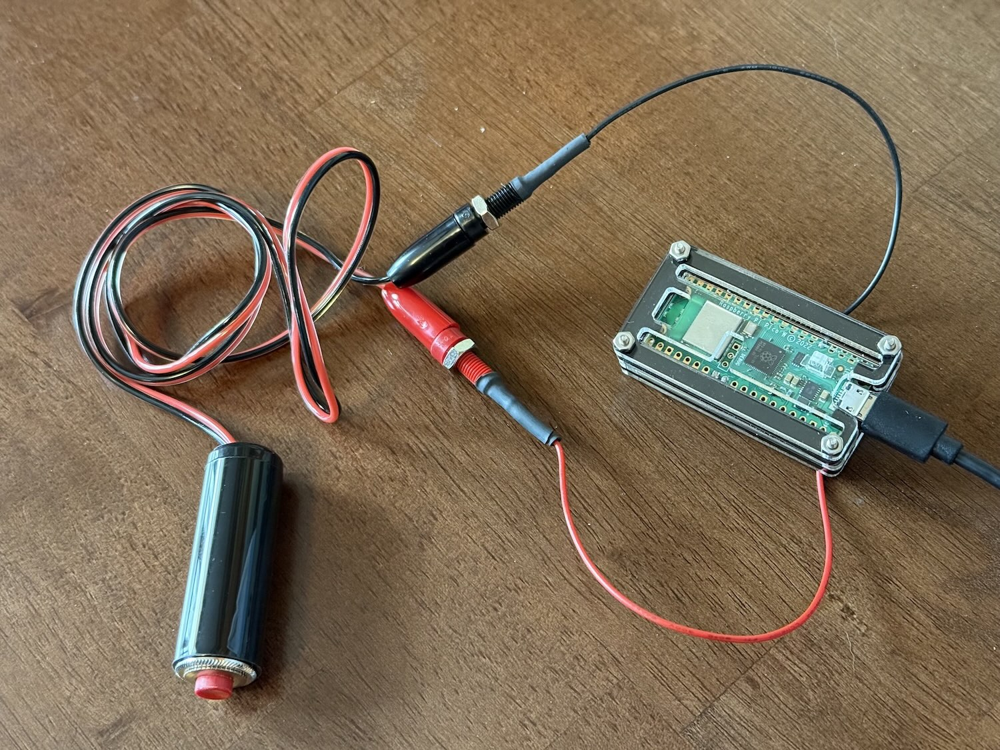

#  Morse Code to Email

It's 2 AM, and I just had an idea, or something I need to remember. I don't want to disturb my wife by getting up, and even the very-dim light from my phone can be bothersome. [Writing is difficult](https://en.wikipedia.org/wiki/Nyctography). What's the answer? Morse code, of course!

I built a device using a $6 [Raspberry Pi Pico W])(https://www.adafruit.com/product/5526) and a silent handheld switch. The switch is connected to a GPIO pin. On powerup, it connects to wifi, and immediately starts listening for morse code. Once a morse code sequence is received and has been silent for 10 seconds, it POSTs the text to a web service, which then emails it to me.

